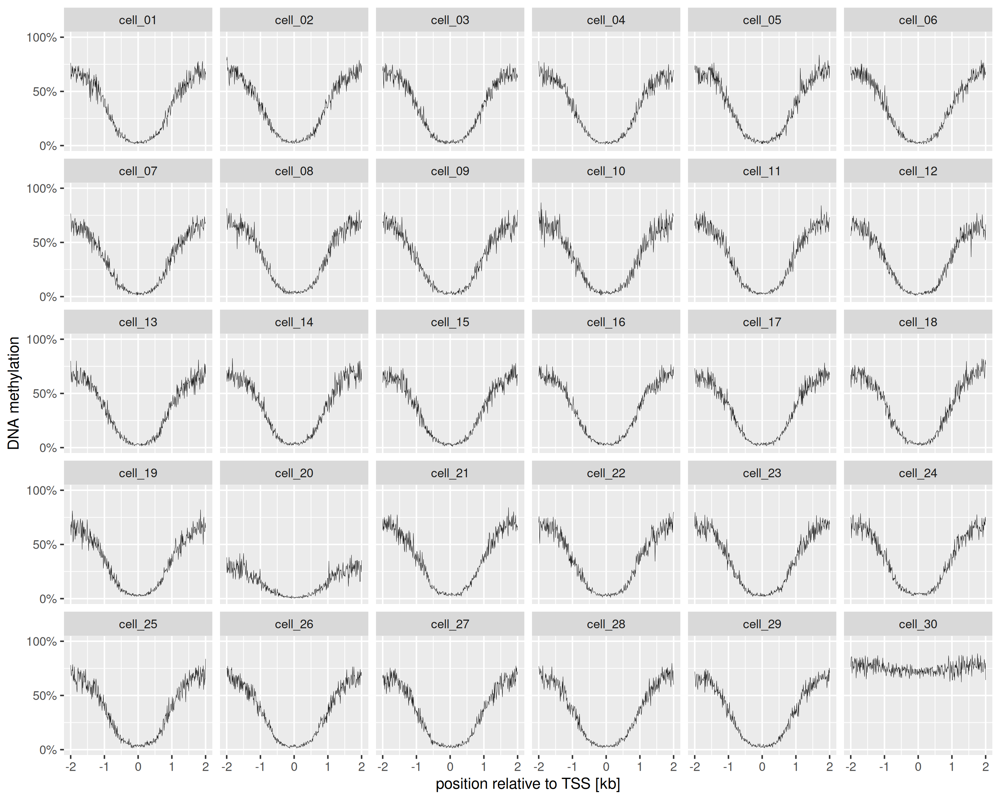
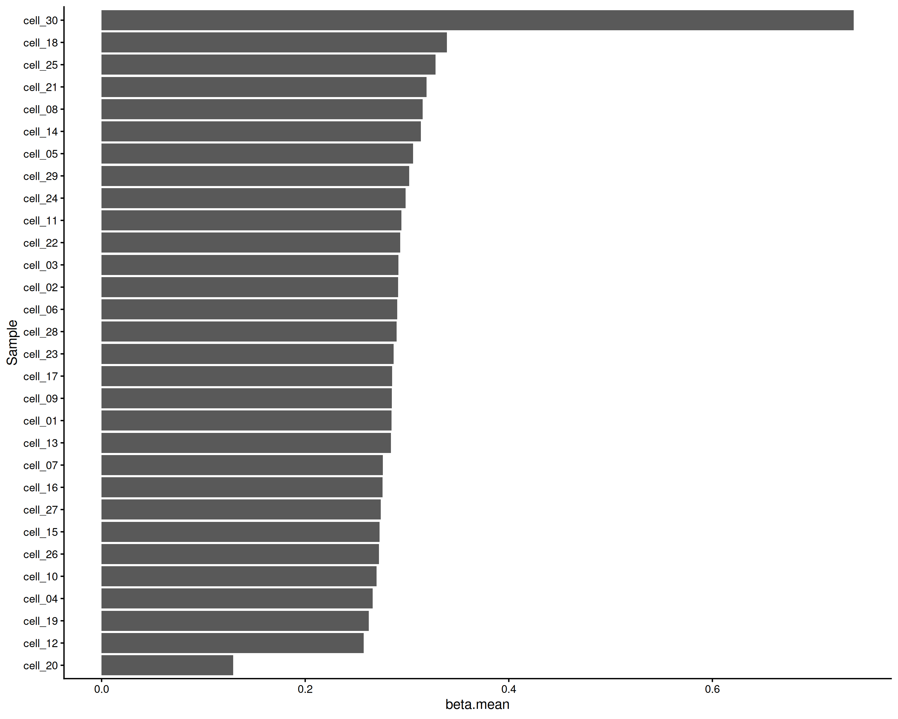

# Plotting TSS methylation profiles

The workflow here shows how *iscream* can be used to quickly explore
methylation profiles of given genomic regions. *iscream’s* tabix
querying functionality can be used to plot methylation profiles around
transcription start sites (TSS).

*methscan* is a tool used to analyze single-cell bisulfite sequencing
data to find differentially methylated regions (DMRs) in the genome. The
plot created here is a reproduction of the TSS methylation profile plot
made in the [*methscan*
tutorial](https://anders-biostat.github.io/MethSCAn/tutorial.html#2-filtering-low-quality-cells)
as part of the filtering done before DMR analysis. The *methscan*
workflow to produce the plot involves three steps:

- converting the coverage BED files into Numpy sparse matrices on disk

- generating the TSS profiles from these matrices

- summarizing and plotting

Although *iscream* is not designed to run analyses on full genomes, it
can be used to explore regions such as TSS flanking regions, gene
bodies, or DMRs found using tools like *methscan* more efficiently. For
example, using iscream, all the steps above can be done in R directly
from tabixed BED files for both single-cell and bulk data. With
*methscan* the first two steps are run on the command line while the
third is done in R.

## Setup

``` r
options("iscream.threads" = 8)
library(iscream)
library(data.table)
library(ggplot2)
```

### Download the data

Running this vignette requires downloading 18MB of BED files and tabix
indices from this Zenodo record: <https://zenodo.org/records/14733834>

``` r
library("BiocFileCache") |> suppressPackageStartupMessages()
cachedir <- BiocFileCache()
methscan_zip_path <- bfcrpath(cachedir, "https://zenodo.org/records/14733834/files/methscan_data.zip")
methscan_unzip <- file.path(tempdir(), "methscan")
unzip(methscan_zip_path, exdir = methscan_unzip)
methscan_dir <- file.path(methscan_unzip, "scbs_tutorial_data")
start_time = proc.time()
```

First, we generate a list of the BED file paths:

``` r
bedfiles <- list.files(
    methscan_dir,
    pattern = "*.cov.gz$",
    full.names = TRUE
)
```

## Using `tabix()`

### Get the Transcription start sites and flanking regions

Then we read the provided TSS BED file and create 2kb flanking regions
around the start sites.

``` r
tss.regions <- fread(
    file.path(methscan_dir, "Mus_musculus.GRCm38.102_TSS.bed"), drop = c(3, 5, 6)
)
colnames(tss.regions) <- c("chr", "tss", "geneID")
head(tss.regions)
```

    ##       chr     tss             geneID
    ##    <char>   <int>             <char>
    ## 1:      1 3671498 ENSMUSG00000051951
    ## 2:      1 4409241 ENSMUSG00000025900
    ## 3:      1 4496413 ENSMUSG00000025902
    ## 4:      1 4785739 ENSMUSG00000033845
    ## 5:      1 4807823 ENSMUSG00000025903
    ## 6:      1 4857814 ENSMUSG00000033813

``` r
tss.regions[, `:=`(tss.start = tss - 2000, tss.end = tss + 2000)]

# make a new data frame with chr, start, end as iscream requires these columns
tss.for_query <- tss.regions[, .(chr, start = tss.start, end = tss.end)]
```

### Make a tabix query of the TSS flanking regions

The
[`tabix()`](https://huishenlab.github.io/iscream/dev/reference/tabix.md)
function queries the provided BED files for the TSS flanking regions to
produce a data frame:

``` r
query_runtime.start <- proc.time()
tss.query <- tabix(bedfiles, tss.for_query, aligner = "bismark")
head(tss.query)
```

    ##       chr   start     end methylation.percentage count.methylated
    ##    <char>   <int>   <int>                  <num>            <int>
    ## 1:      1 4785488 4785488                      0                0
    ## 2:      1 4785513 4785513                      0                0
    ## 3:      1 4785522 4785522                      0                0
    ## 4:      1 4785533 4785533                      0                0
    ## 5:      1 4786780 4786780                    100                1
    ## 6:      1 4786886 4786886                    100                1
    ##    count.unmethylated    file
    ##                 <int>  <char>
    ## 1:                  2 cell_01
    ## 2:                  2 cell_01
    ## 3:                  2 cell_01
    ## 4:                  2 cell_01
    ## 5:                  0 cell_01
    ## 6:                  0 cell_01

### Summarize average methylation profile around TSS

Given the CpG level methylation data frame, we now
[join](https://rdatatable.gitlab.io/data.table/library/data.table/doc/datatable-joins.html)
the queried data based on CpGs that fall within the TSS flanking regions
to get the CpGs 2kb around the TSS. We can also set a new `position`
column relative to the TSS (using rounded values as in the *methscan*
tutorial):

``` r
# join
tss.profile <- tss.regions[tss.query, .(
    chr,
    start,
    position = round(start - tss, -1L),
    methylation.percentage,
    file
  ),
  on = .(chr, tss.start <= start, tss.end >= end)
] |> unique()

# get mean methylation by relative position and cell
tss.summary <- tss.profile[,
  .(meth_frac = mean(methylation.percentage/100)),
  by = .(position, file)
]

query_runtime <- timetaken(query_runtime.start)
```

Time to make the query and compute the summary: 2.444s elapsed (5.262s
cpu).

### Plot average methylation profiles around the TSS

``` r
tss.plot <- ggplot(tss.summary, aes(x = position / 1000, y = meth_frac)) +
  scale_y_continuous(
    labels=scales::percent_format(accuracy=1),
    limits=c(0, 1), breaks=c(0, .5, 1)
  ) +
  geom_line(linewidth = .1) +
  facet_wrap(~file) +
  labs(x = "position relative to TSS [kb]", y = "DNA methylation")

total_runtime <- timetaken(start_time)

tss.plot
```



TSS profiles

Total runtime, from getting the BED files and regions to making the
query, calculating the summaries and plotting: 2.489s elapsed (5.307s
cpu). With methscan, generating the TSS methylation profiles alone took
11 seconds.

## Using `summarize_regions`

A similar analysis can be done using the
[`summarize_regions()`](https://huishenlab.github.io/iscream/dev/reference/summarize_regions.md)
function if you only need to see the distribution of beta means by file,
rather than means by relative position per file

``` r
library("ggridges")
tss.means <- summarize_meth_regions(
  bedfiles,
  tss.for_query,
  aligner = "bismark",
  fun = "mean",
  mval = FALSE
) |> as.data.table()
```

    ## [11:28:24.770899] [iscream::summarize_regions] [info] Summarizing 21622 regions from 30 bedfiles
    ## [11:28:24.770922] [iscream::summarize_regions] [info] using mean
    ## [11:28:24.770925] [iscream::summarize_regions] [info] with columns 4, 5 as coverage, beta

``` r
ggplot(tss.means, aes(x = beta.mean, y = file, fill = after_stat(x))) +
  geom_density_ridges_gradient() +
  scale_fill_distiller(palette = "BrBG") +
  theme_classic()
```


TSS distribution by file

For per-file means you could collapse the means within file:

``` r
tss.means[, .(beta.mean = mean(beta.mean, na.rm = TRUE)), by = file] |>
  ggplot(
    aes(
      x = reorder(file, beta.mean),
      y = beta.mean)
    ) +
  geom_bar(stat = 'identity') +
  theme_classic() +
  coord_flip() +
  labs(x = "Sample")
```



Mean TSS by file

## Session info

``` r
sessionInfo()
```

    ## R version 4.5.1 (2025-06-13)
    ## Platform: x86_64-pc-linux-gnu
    ## Running under: Ubuntu 24.04.2 LTS
    ## 
    ## Matrix products: default
    ## BLAS/LAPACK: /nix/store/yf6dpab0gcjr9gvpww1zlafs9n0f48h3-blas-3/lib/libblas.so.3;  LAPACK version 3.12.0
    ## 
    ## locale:
    ##  [1] LC_CTYPE=en_US.UTF-8       LC_NUMERIC=C              
    ##  [3] LC_TIME=en_US.UTF-8        LC_COLLATE=en_US.UTF-8    
    ##  [5] LC_MONETARY=en_US.UTF-8    LC_MESSAGES=en_US.UTF-8   
    ##  [7] LC_PAPER=en_US.UTF-8       LC_NAME=C                 
    ##  [9] LC_ADDRESS=C               LC_TELEPHONE=C            
    ## [11] LC_MEASUREMENT=en_US.UTF-8 LC_IDENTIFICATION=C       
    ## 
    ## time zone: America/Detroit
    ## tzcode source: system (glibc)
    ## 
    ## attached base packages:
    ## [1] stats     graphics  grDevices utils     datasets  methods   base     
    ## 
    ## other attached packages:
    ## [1] ggridges_0.5.7       BiocFileCache_2.99.6 dbplyr_2.5.1        
    ## [4] ggplot2_4.0.0        data.table_1.17.8    iscream_0.99.9      
    ## 
    ## loaded via a namespace (and not attached):
    ##  [1] Matrix_1.7-4          bit_4.6.0             gtable_0.3.6         
    ##  [4] dplyr_1.1.4           compiler_4.5.1        filelock_1.0.3       
    ##  [7] tidyselect_1.2.1      Rcpp_1.1.0            blob_1.2.4           
    ## [10] parallel_4.5.1        scales_1.4.0          fastmap_1.2.0        
    ## [13] lattice_0.22-7        R6_2.6.1              labeling_0.4.3       
    ## [16] generics_0.1.4        curl_7.0.0            httr2_1.2.1          
    ## [19] knitr_1.50            tibble_3.3.0          stringfish_0.17.0    
    ## [22] DBI_1.2.3             pillar_1.11.1         RColorBrewer_1.1-3   
    ## [25] rlang_1.1.6           cachem_1.1.0          xfun_0.53            
    ## [28] S7_0.2.0              bit64_4.6.0-1         RcppParallel_5.1.11-1
    ## [31] memoise_2.0.1         RSQLite_2.4.3         cli_3.6.5            
    ## [34] withr_3.0.2           magrittr_2.0.4        grid_4.5.1           
    ## [37] pbapply_1.7-4         rappdirs_0.3.3        lifecycle_1.0.4      
    ## [40] vctrs_0.6.5           evaluate_1.0.5        glue_1.8.0           
    ## [43] farver_2.1.2          parallelly_1.45.1     purrr_1.1.0          
    ## [46] tools_4.5.1           pkgconfig_2.0.3
