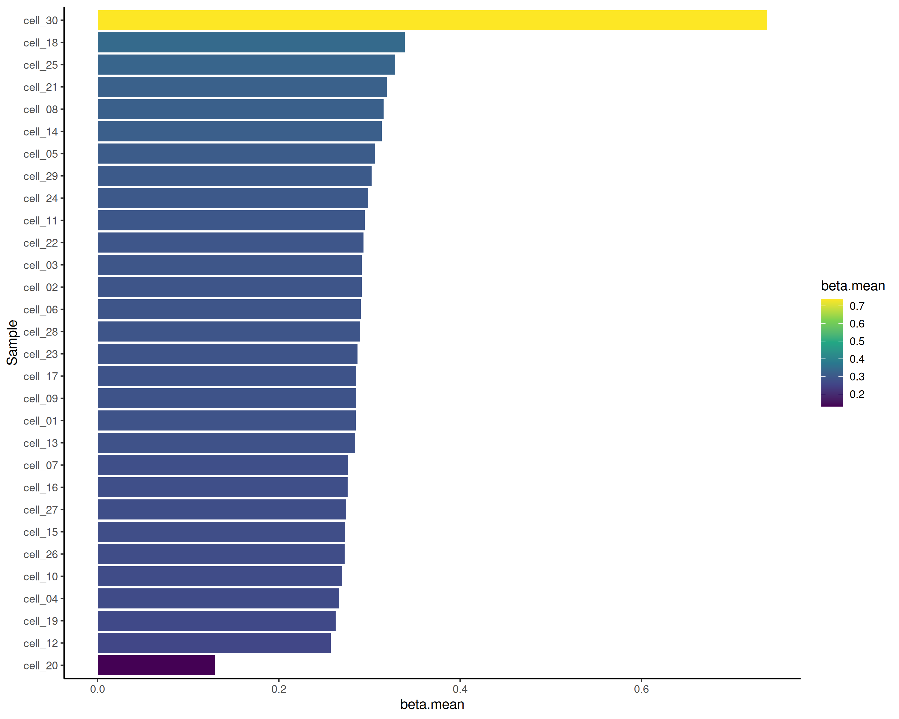

The workflow here shows how *iscream* can be used to quickly explore methylation
profiles of given genomic regions. *iscream's* tabix querying functionality can
be used to plot methylation profiles around transcription start sites (TSS).

*methscan* is a tool used to analyze single-cell bisulfite sequencing data to
find differentially methylated regions (DMRs) in the genome. The plot created
here is a reproduction of the TSS methylation profile plot made in the
[*methscan*
tutorial](https://anders-biostat.github.io/MethSCAn/tutorial.html#2-filtering-low-quality-cells)
as part of the filtering done before DMR analysis. The *methscan* workflow to
produce the plot involves three steps:

- converting the coverage BED files into Numpy sparse matrices on disk

- generating the TSS profiles from these matrices

- summarizing and plotting

The first two steps are run on the command line with *methscan* while the third
is done in R.

Although *iscream* is not designed to run analyses on full genomes, it can be
used to explore regions such as TSS flanking regions, gene bodies, or DMRs found
using tools like *methscan* more efficiently. For example, using iscream,
producing the plot of TSS methylation profiles can be done in R directly from
tabixed BED files for both single-cell and bulk data.

### Setup


``` r
options("iscream.threads" = 8)
library(iscream)
library(data.table)
library(ggplot2)
```

### Download the data

Running this vignette requires downloading 18MB of BED files and tabix indices
from this Zenodo record: <https://zenodo.org/records/14733834>


``` r
methscan_zip_path <- tempfile("methscan")
methscan_dir <- tempdir()
download.file(
    "https://zenodo.org/records/14733834/files/methscan_data.zip",
    destfile = methscan_zip_path
)
unzip(methscan_zip_path, exdir = methscan_dir)
start_time = proc.time()
```


First, we generate a list of the BED file paths:


``` r
bedfiles <- list.files(
    data_dir,
    pattern = "*.cov.gz$",
    full.names = TRUE
)
```

### Get the Transcription start sites and flanking regions

Then we read the provided TSS BED file and create 2kb flanking regions around
the start sites.


``` r
tss.regions <- fread(
    paste0(data_dir, "/Mus_musculus.GRCm38.102_TSS.bed"), drop = c(3, 5, 6)
)
colnames(tss.regions) <- c("chr", "tss", "geneID")
head(tss.regions)
```

```
##       chr     tss             geneID
##    <char>   <int>             <char>
## 1:      1 3671498 ENSMUSG00000051951
## 2:      1 4409241 ENSMUSG00000025900
## 3:      1 4496413 ENSMUSG00000025902
## 4:      1 4785739 ENSMUSG00000033845
## 5:      1 4807823 ENSMUSG00000025903
## 6:      1 4857814 ENSMUSG00000033813
```

``` r
tss.regions[, `:=`(tss.start = tss - 2000, tss.end = tss + 2000)]

# make a new data frame with chr, start, end as iscream requires these columns
tss.for_query <- tss.regions[, .(chr, start = tss.start, end = tss.end)]
```

### Make a tabix query of the TSS flanking regions

The `tabix()` function queries the provided BED files for the TSS flanking
regions to produce a data frame:


``` r
query_runtime.start <- proc.time()
tss.query <- tabix(bedfiles, tss.for_query, aligner = "bismark")
head(tss.query)
```

```
##       chr   start     end methylation.percentage count.methylated
##    <char>   <int>   <int>                  <num>            <int>
## 1:      1 4785488 4785488                      0                0
## 2:      1 4785513 4785513                      0                0
## 3:      1 4785522 4785522                      0                0
## 4:      1 4785533 4785533                      0                0
## 5:      1 4786780 4786780                    100                1
## 6:      1 4786886 4786886                    100                1
##    count.unmethylated  sample
##                 <int>  <char>
## 1:                  2 cell_01
## 2:                  2 cell_01
## 3:                  2 cell_01
## 4:                  2 cell_01
## 5:                  0 cell_01
## 6:                  0 cell_01
```

### Summarize average methylation profile around TSS

Given the CpG level methylation data frame, we now join the queried data based
on CpGs that fall within the TSS flanking regions to get the CpGs 2kb around the
TSS. We can also set a new `position` column relative to the TSS (using rounded
values as in the *methscan* tutorial):


``` r
# join
tss.profile <- tss.regions[tss.query, .(
    chr,
    start,
    position = round(start - tss, -1L),
    methylation.percentage,
    sample
  ),
  on = .(chr, tss.start <= start, tss.end >= end)
] |> unique()

# get mean methylation by relative position and cell
tss.summary <- tss.profile[,
  .(meth_frac = mean(methylation.percentage/100)),
  by = .(position, sample)
]

query_runtime <- timetaken(query_runtime.start)
```

Time to make the query and compute the summary: 3.389s elapsed (53.1s cpu).

### Plot average methylation profiles around the TSS


``` r
tss.plot <- ggplot(tss.summary, aes(x = position / 1000, y = meth_frac)) +
  scale_y_continuous(
    labels=scales::percent_format(accuracy=1),
    limits=c(0, 1), breaks=c(0, .5, 1)
  ) +
  geom_line(linewidth = .1) +
  facet_wrap(~sample) +
  labs(x = "position relative to TSS [kb]", y = "DNA methylation")

total_runtime <- timetaken(start_time)

tss.plot
```

<div class="figure" style="text-align: center">

<p class="caption">TSS profiles</p>
</div>


Total runtime, from getting the bedfiles and regions to making the query,
calculating the summaries and plotting: 3.458s elapsed (53.2s cpu). With methscan,
generating the TSS methylation profiles alone took 11 seconds.

### Using `summarize_regions`

A similar analysis can be done using the `summarize_regions()` function if you
only need to see the distribution of beta means by sample, rather than means by
relative position per sample.


``` r
library("ggridges")
tss.means <- summarize_meth_regions(
  bedfiles,
  tss.for_query,
  aligner = "bismark",
  fun = "mean",
  mval = FALSE
) |> as.data.table()
```

```
## [11:26:01.827829] [iscream::summarize_regions] [info] Summarizing 21622 regions from 30 bedfiles
## [11:26:01.827888] [iscream::summarize_regions] [info] using mean
## [11:26:01.827894] [iscream::summarize_regions] [info] with columns 4, 5 as coverage, beta
```

``` r
ggplot(tss.means, aes(x = beta.mean, y = file, fill = after_stat(x))) +
  geom_density_ridges_gradient() +
  scale_fill_distiller(palette = "BrBG") +
  theme_classic()
```

<div class="figure" style="text-align: center">

<p class="caption">TSS distribution by sample</p>
</div>

For per-sample means you could collapse the means within samples:


``` r
tss.means[, .(beta.mean = mean(beta.mean, na.rm = TRUE)), by = file] |>
  ggplot(
    aes(
      x = reorder(file, beta.mean),
      y = beta.mean,
      fill = beta.mean)
    ) +
  geom_bar(stat = 'identity') +
  scale_fill_viridis_c() +
  theme_classic() +
  coord_flip() +
  labs(x = "Sample")
```

<div class="figure" style="text-align: center">

<p class="caption">Mean TSS by sample</p>
</div>


## Session info


``` r
sessionInfo()
```

```
## R version 4.4.2 (2024-10-31)
## Platform: x86_64-pc-linux-gnu
## Running under: AlmaLinux 9.5 (Teal Serval)
## 
## Matrix products: default
## BLAS/LAPACK: /usr/lib64/libopenblas-r0.3.26.so;  LAPACK version 3.12.0
## 
## locale:
##  [1] LC_CTYPE=C.utf8        LC_NUMERIC=C           LC_TIME=C.UTF-8       
##  [4] LC_COLLATE=C.utf8      LC_MONETARY=C.UTF-8    LC_MESSAGES=C.utf8    
##  [7] LC_PAPER=C.UTF-8       LC_NAME=C              LC_ADDRESS=C          
## [10] LC_TELEPHONE=C         LC_MEASUREMENT=C.UTF-8 LC_IDENTIFICATION=C   
## 
## time zone: UTC
## tzcode source: internal
## 
## attached base packages:
## [1] stats     graphics  grDevices utils     datasets  methods   base     
## 
## other attached packages:
## [1] ggridges_0.5.6     ggplot2_3.5.1      data.table_1.17.0  iscream_0.0.0.9000
## 
## loaded via a namespace (and not attached):
##  [1] vctrs_0.6.5         cli_3.6.4           knitr_1.50         
##  [4] rlang_1.1.5         xfun_0.51           generics_0.1.3     
##  [7] labeling_0.4.3      RcppParallel_5.1.10 glue_1.8.0         
## [10] colorspace_2.1-1    stringfish_0.16.0   scales_1.3.0       
## [13] grid_4.4.2          evaluate_1.0.3      munsell_0.5.1      
## [16] tibble_3.2.1        lifecycle_1.0.4     compiler_4.4.2     
## [19] dplyr_1.1.4         RColorBrewer_1.1-3  Rcpp_1.0.14        
## [22] pkgconfig_2.0.3     farver_2.1.2        lattice_0.22-6     
## [25] viridisLite_0.4.2   R6_2.6.1            tidyselect_1.2.1   
## [28] pillar_1.10.1       parallelly_1.43.0   parallel_4.4.2     
## [31] magrittr_2.0.3      Matrix_1.7-3        withr_3.0.2        
## [34] tools_4.4.2         gtable_0.3.6
```

<!-- vim: set filetype=rmd: -->
