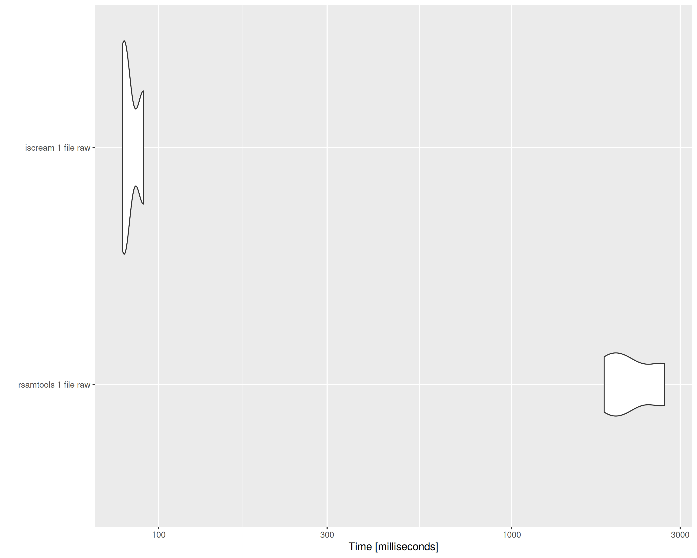
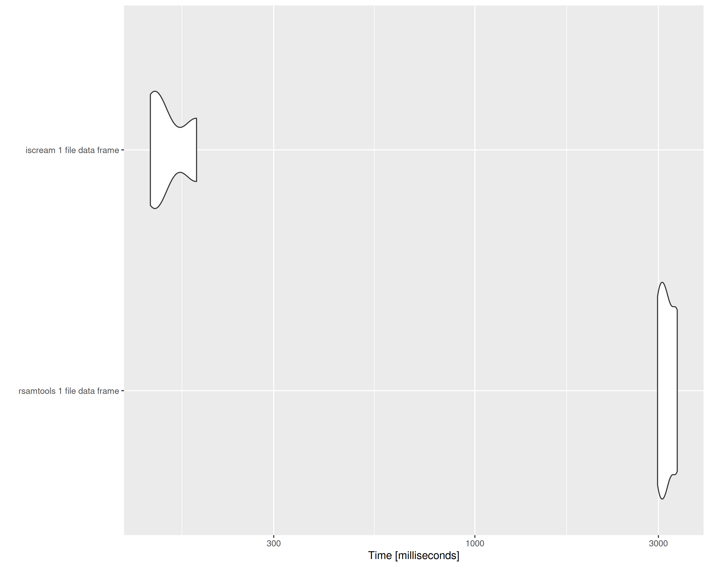
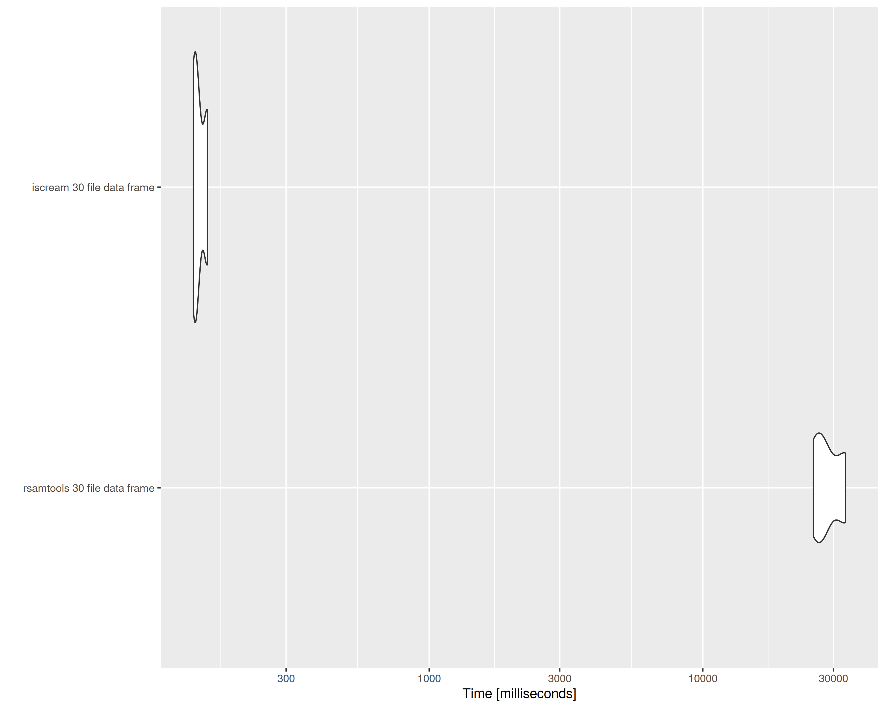
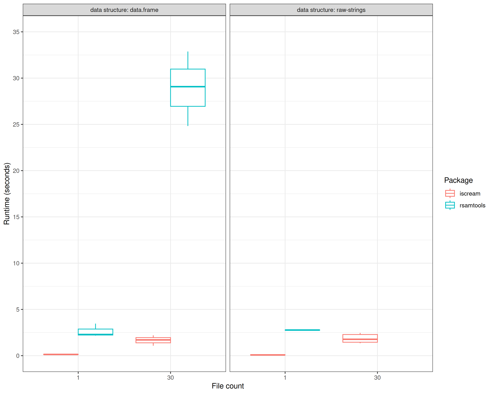
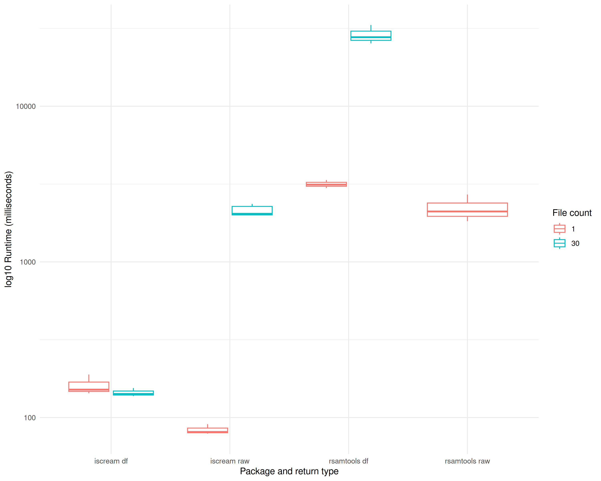

Both iscream and Rsamtools can be used to query records from tabixed BED files
in R. Here we compare their usability and performance using the methscan
dataset.

This vignette uses mouse WGBS data from *methscan* as in the [Plotting TSS
profiles tutorial](./TSS.Rmd) and mouse promoter regions. Running it requires
downloading 18MB of BED files and tabix indices from this Zenodo record:
<https://zenodo.org/records/14733834>

``` r
methscan_zip_path <- tempfile("methscan")
methscan_dir <- tempdir()
download.file(
    "https://zenodo.org/records/14733834/files/methscan_data.zip",
    destfile = methscan_zip_path
)
unzip(methscan_zip_path, exdir = methscan_dir)
```

iscream normally uses htslib to query BED files and store the data in memory.
However, iscream's `tabix` function can use the tabix executable to make tabix
queries because the shell program's stream-to-file approach is faster than
allocating and storing strings in memory. By default, the `"tabix.method"`
option is set to "shell" and iscream's `tabix` will look for the tabix
executable, falling back to using htslib only if it's not found. Here, the
`"tabix.method"` option is set to "htslib" to make fair comparisons between
Rsamtools and iscream since `scanTabix` does not use the executable, but stores
the strings in memory.


``` r
library(iscream)
```

```
## iscream using 1 thread by default but parallelly::availableCores() detects 16 possibly available threads. See `?set_threads` for information on multithreading before trying to use more.
```

``` r
options("tabix.method" = 'htslib')
options("iscream.threads" = 8)
```

Using `scanTabix` requires the input regions to be `GRanges`. `iscream::tabix`
accepts strings, data frames and GRanges.


``` r
library(data.table)
library(GenomicRanges) |> suppressPackageStartupMessages()
library(Rsamtools) |> suppressPackageStartupMessages()
library(microbenchmark)
library(parallel)
library(ggplot2)
```


``` r
methscan_files <- list.files(
  data_dir,
  full.names = T,
  pattern = "*.cov.gz$"
)
mouse_promoters <- fread(paste0(data_dir, "/mouse_promoters.bed"), col.names = c("chr", "start", "end"))
mouse_promoters.gr <- GRanges(mouse_promoters)
```


# One file

`tabix` with `raw = TRUE` and `scanTabix` produce a list of unparsed or raw
strings. The result of both are identical.


``` r
bench_1_raw <- microbenchmark(
  `rsamtools 1 file raw` = rq <- scanTabix(methscan_files[1], param = mouse_promoters.gr),
  `iscream 1 file raw` = iq <- tabix(methscan_files[1], mouse_promoters, raw = TRUE),
  times = 3
)
bench_1_raw
```

```
## Unit: milliseconds
##                  expr        min         lq       mean     median         uq
##  rsamtools 1 file raw 2058.93989 2064.65614 2114.46048 2070.37240 2142.22078
##    iscream 1 file raw   77.67272   80.20395   81.12257   82.73518   82.84749
##         max neval
##  2214.06916     3
##    82.95981     3
```

``` r
autoplot(bench_1_raw)
```

```
## Warning: `aes_string()` was deprecated in ggplot2 3.0.0.
## ℹ Please use tidy evaluation idioms with `aes()`.
## ℹ See also `vignette("ggplot2-in-packages")` for more information.
## ℹ The deprecated feature was likely used in the microbenchmark package.
##   Please report the issue at <https://github.com/joshuaulrich/microbenchmark/issues/>.
## This warning is displayed once every 8 hours.
## Call `lifecycle::last_lifecycle_warnings()` to see where this warning was generated.
```

<div class="figure" style="text-align: center">

<p class="caption">tabix vs scanTabix raw string output on 1 file</p>
</div>

``` r
iq[1:5]
```

```
## $`1:3669498-3673498`
## character(0)
## 
## $`1:4407241-4411241`
## character(0)
## 
## $`1:4494413-4498413`
## character(0)
## 
## $`1:4783739-4787739`
## [1] "1\t4785488\t4785488\t0.000000\t0\t2"  
## [2] "1\t4785513\t4785513\t0.000000\t0\t2"  
## [3] "1\t4785522\t4785522\t0.000000\t0\t2"  
## [4] "1\t4785533\t4785533\t0.000000\t0\t2"  
## [5] "1\t4786780\t4786780\t100.000000\t1\t0"
## [6] "1\t4786886\t4786886\t100.000000\t1\t0"
## [7] "1\t4786958\t4786958\t100.000000\t1\t0"
## 
## $`1:4805823-4809823`
## [1] "1\t4806176\t4806176\t100.000000\t1\t0"
## [2] "1\t4806221\t4806221\t100.000000\t1\t0"
## [3] "1\t4807572\t4807572\t0.000000\t0\t1"  
## [4] "1\t4807669\t4807669\t0.000000\t0\t2"  
## [5] "1\t4807682\t4807682\t0.000000\t0\t2"  
## [6] "1\t4807872\t4807872\t0.000000\t0\t1"  
## [7] "1\t4807890\t4807890\t0.000000\t0\t1"  
## [8] "1\t4807940\t4807940\t0.000000\t0\t1"  
## [9] "1\t4807950\t4807950\t0.000000\t0\t1"
```

``` r
all.equal(iq, rq)
```

```
## [1] TRUE
```


# Multiple files

`tabix` can also take multiple files in the same call. It returns the raw
strings, but each input file is a list of it's own. `scanTabix` does not support
this.


``` r
bench_30_raw <- microbenchmark(
  `iscream 30 files raw` = iq <- tabix(methscan_files, mouse_promoters, raw = TRUE),
  times = 3
)
bench_30_raw
```

```
## Unit: seconds
##                  expr      min       lq     mean   median       uq      max
##  iscream 30 files raw 1.758214 1.875702 2.061496 1.993191 2.213138 2.433085
##  neval
##      3
```

``` r
names(iq)
```

```
##  [1] "cell_01" "cell_02" "cell_03" "cell_04" "cell_05" "cell_06" "cell_07"
##  [8] "cell_08" "cell_09" "cell_10" "cell_11" "cell_12" "cell_13" "cell_14"
## [15] "cell_15" "cell_16" "cell_17" "cell_18" "cell_19" "cell_20" "cell_21"
## [22] "cell_22" "cell_23" "cell_24" "cell_25" "cell_26" "cell_27" "cell_28"
## [29] "cell_29" "cell_30"
```

``` r
iq[["cell_01"]][1:5]
```

```
## $`1:3669498-3673498`
## character(0)
## 
## $`1:4407241-4411241`
## character(0)
## 
## $`1:4494413-4498413`
## character(0)
## 
## $`1:4783739-4787739`
## [1] "1\t4785488\t4785488\t0.000000\t0\t2"  
## [2] "1\t4785513\t4785513\t0.000000\t0\t2"  
## [3] "1\t4785522\t4785522\t0.000000\t0\t2"  
## [4] "1\t4785533\t4785533\t0.000000\t0\t2"  
## [5] "1\t4786780\t4786780\t100.000000\t1\t0"
## [6] "1\t4786886\t4786886\t100.000000\t1\t0"
## [7] "1\t4786958\t4786958\t100.000000\t1\t0"
## 
## $`1:4805823-4809823`
## [1] "1\t4806176\t4806176\t100.000000\t1\t0"
## [2] "1\t4806221\t4806221\t100.000000\t1\t0"
## [3] "1\t4807572\t4807572\t0.000000\t0\t1"  
## [4] "1\t4807669\t4807669\t0.000000\t0\t2"  
## [5] "1\t4807682\t4807682\t0.000000\t0\t2"  
## [6] "1\t4807872\t4807872\t0.000000\t0\t1"  
## [7] "1\t4807890\t4807890\t0.000000\t0\t1"  
## [8] "1\t4807940\t4807940\t0.000000\t0\t1"  
## [9] "1\t4807950\t4807950\t0.000000\t0\t1"
```

``` r
scanTabix(methscan_files, param = GRanges(mouse_promoters))
```

```
## Error in h(simpleError(msg, call)): error in evaluating the argument 'file' in selecting a method for function 'scanTabix': 'file' must be length 1
```

# Parsing records into a data frame

A parsed data frame is more useful than a list of raw strings - use `tabix()`
instead of `tabix_raw()`. For `scanTabix`, this custom function parses the list
of strings to make a similar data frame:


``` r
rtbx <- function(bed) {
  q <- scanTabix(bed, param = GRanges(mouse_promoters)) |>
    lapply(strsplit, split = "\t") |>
    Filter(function(i) length(i) != 0, x = _) |>
    unlist(recursive = FALSE) |>
    do.call(rbind, args = _) |>
    as.data.table() |>
    setnames(c("chr", "start", "end", paste0("V", 1:3)))
  q
}

bench_1_df <- microbenchmark(
  `rsamtools 1 file data frame` = rq <- rtbx(methscan_files[1]),
  `iscream 1 file data frame` = iq <- tabix(methscan_files[1], mouse_promoters),
  times = 3
)
rq
```

```
##           chr     start       end         V1     V2     V3
##        <char>    <char>    <char>     <char> <char> <char>
##     1:      1   4785488   4785488   0.000000      0      2
##     2:      1   4785513   4785513   0.000000      0      2
##     3:      1   4785522   4785522   0.000000      0      2
##     4:      1   4785533   4785533   0.000000      0      2
##     5:      1   4786780   4786780 100.000000      1      0
##    ---                                                    
## 79900:      X 168673566 168673566   0.000000      0      1
## 79901:      X 168673577 168673577   0.000000      0      1
## 79902:      X 168674670 168674670   0.000000      0      1
## 79903:      X 168675047 168675047   0.000000      0      1
## 79904:      X 169318831 169318831 100.000000      1      0
```

``` r
iq
```

```
##           chr     start       end    V1    V2    V3
##        <char>     <int>     <int> <num> <int> <int>
##     1:      1   4785488   4785488     0     0     2
##     2:      1   4785513   4785513     0     0     2
##     3:      1   4785522   4785522     0     0     2
##     4:      1   4785533   4785533     0     0     2
##     5:      1   4786780   4786780   100     1     0
##    ---                                             
## 79900:      X 168673566 168673566     0     0     1
## 79901:      X 168673577 168673577     0     0     1
## 79902:      X 168674670 168674670     0     0     1
## 79903:      X 168675047 168675047     0     0     1
## 79904:      X 169318831 169318831   100     1     0
```

``` r
all.equal(iq, rq, check.attributes = F)
```

```
## [1] "Datasets have different column modes. First 3: start(numeric!=character) end(numeric!=character) V1(numeric!=character)"
```

The column types are different but the data is identical.


``` r
bench_1_df
```

```
## Unit: milliseconds
##                         expr       min        lq      mean   median        uq
##  rsamtools 1 file data frame 2011.4551 2233.9409 2698.4112 2456.427 3041.8892
##    iscream 1 file data frame  137.4999  139.2765  143.6715  141.053  146.7572
##        max neval
##  3627.3517     3
##   152.4614     3
```

``` r
autoplot(bench_1_df)
```

<div class="figure" style="text-align: center">

<p class="caption">tabix vs scanTabix parsed data frame from 1 file</p>
</div>

# Multiple files as data frame

We can try to query multiple BED files using Rsamtools with this function that 8
cores like iscream does:


``` r
partbx <- function(bedfiles) {
  mclapply(
    methscan_files,
    function(bed) {
      query <- rtbx(bed)[, file := tools::file_path_sans_ext(basename(bed), compression = TRUE)][]
      setnames(query, c("chr", "start", "end", "beta", "M", "U", "file"))
      query
    },
    mc.cores = 8
  ) |>
    rbindlist()
}

bench_30_df <- microbenchmark(
  `rsamtools 30 file data frame` = rq <- partbx(methscan_files[1]),
  `iscream 30 file data frame` = iq <- tabix(methscan_files[1], mouse_promoters, col.names = c("beta", "M", "U")),
  times = 3
)
bench_30_df
```

```
## Unit: seconds
##                          expr       min        lq      mean   median        uq
##  rsamtools 30 file data frame 25.998420 27.379231 28.280409 28.76004 29.421403
##    iscream 30 file data frame  1.084235  1.401823  1.628902  1.71941  1.901235
##       max neval
##  30.08276     3
##   2.08306     3
```

``` r
autoplot(bench_30_df)
```

<div class="figure" style="text-align: center">

<p class="caption">tabix vs scanTabix parsed data frame from 30 files</p>
</div>


## All benchmarks {.tabset}


``` r
bench_all <- rbind(bench_1_raw, bench_30_raw, bench_1_df, bench_30_raw, bench_30_df)

bench.dt <- as.data.table(bench_all)[, .(
  time       = time / 1000000,
  package    = fifelse(grepl("iscream", expr), "iscream", "rsamtools"),
  files      = fifelse(grepl("1", expr), 1, 30),
  data.frame = fifelse(grepl("raw", expr), FALSE, TRUE)
)][,
  package := paste(package, fifelse(data.frame, "df", "raw"))
]

plt <- ggplot(bench.dt, aes(x = package, y = time, color = as.factor(files))) +
    geom_boxplot() +
    labs(x = "Package and return type") +
    scale_color_discrete(name = "File count") +
    theme_minimal()
```


### Runtime


``` r
plt + labs(y = "Runtime (milliseconds)")
```

<div class="figure" style="text-align: center">

<p class="caption">Comparing all benchmarked iscream and Rsamtools querying runtimes</p>
</div>

### Runtime log scale


``` r
plt + scale_y_log10() + labs(y = "log10 Runtime (milliseconds)")
```

<div class="figure" style="text-align: center">

<p class="caption">log10 scaled runtime of all benchmarks run</p>
</div>


## Session info


``` r
sessionInfo()
```

```
## R version 4.5.1 (2025-06-13)
## Platform: x86_64-pc-linux-gnu
## Running under: Ubuntu 24.04.3 LTS
## 
## Matrix products: default
## BLAS/LAPACK: /nix/store/g5b7qnbhjmiac5q4jb5yvahy6pysd88g-blas-3/lib/libblas.so.3;  LAPACK version 3.12.0
## 
## locale:
##  [1] LC_CTYPE=en_US.UTF-8       LC_NUMERIC=C              
##  [3] LC_TIME=en_US.UTF-8        LC_COLLATE=en_US.UTF-8    
##  [5] LC_MONETARY=en_US.UTF-8    LC_MESSAGES=en_US.UTF-8   
##  [7] LC_PAPER=en_US.UTF-8       LC_NAME=C                 
##  [9] LC_ADDRESS=C               LC_TELEPHONE=C            
## [11] LC_MEASUREMENT=en_US.UTF-8 LC_IDENTIFICATION=C       
## 
## time zone: America/Detroit
## tzcode source: system (glibc)
## 
## attached base packages:
## [1] parallel  stats4    stats     graphics  grDevices utils     datasets 
## [8] methods   base     
## 
## other attached packages:
##  [1] ggplot2_4.0.0        microbenchmark_1.5.0 Rsamtools_2.25.3    
##  [4] Biostrings_2.77.2    XVector_0.49.1       GenomicRanges_1.61.5
##  [7] Seqinfo_0.99.2       IRanges_2.43.5       S4Vectors_0.47.4    
## [10] BiocGenerics_0.55.1  generics_0.1.4       data.table_1.17.8   
## [13] iscream_0.99.5       BiocFileCache_2.99.6 dbplyr_2.5.1        
## [16] colorout_1.3-3      
## 
## loaded via a namespace (and not attached):
##  [1] rappdirs_0.3.3        bitops_1.0-9          RSQLite_2.4.3        
##  [4] lattice_0.22-7        magrittr_2.0.4        RColorBrewer_1.1-3   
##  [7] evaluate_1.0.5        grid_4.5.1            fastmap_1.2.0        
## [10] blob_1.2.4            Matrix_1.7-4          DBI_1.2.3            
## [13] purrr_1.1.0           scales_1.4.0          codetools_0.2-20     
## [16] httr2_1.2.1           cli_3.6.5             rlang_1.1.6          
## [19] crayon_1.5.3          parallelly_1.45.1     bit64_4.6.0-1        
## [22] withr_3.0.2           cachem_1.1.0          tools_4.5.1          
## [25] BiocParallel_1.43.4   memoise_2.0.1         dplyr_1.1.4          
## [28] filelock_1.0.3        curl_7.0.0            vctrs_0.6.5          
## [31] R6_2.6.1              lifecycle_1.0.4       stringfish_0.17.0    
## [34] bit_4.6.0             pkgconfig_2.0.3       gtable_0.3.6         
## [37] RcppParallel_5.1.11-1 pillar_1.11.1         glue_1.8.0           
## [40] Rcpp_1.1.0            xfun_0.53             tibble_3.3.0         
## [43] tidyselect_1.2.1      knitr_1.50            farver_2.1.2         
## [46] labeling_0.4.3        compiler_4.5.1        S7_0.2.0
```

<!-- vim: set filetype=rmd: -->
